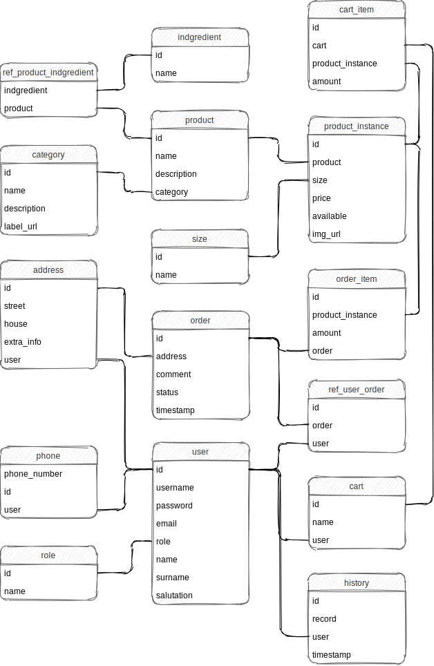

# Pizzeria Web Anwendung mit Oat++


### Installation
This project uses Oat++ Web Framework and requires 
it to be installed in your machine. Just before 
installing make sure you have:
* Git
* C++ compiler supporting C++ version >= 11.
* Make
* CMake version >= 3.1

Finally, to install Oat++, open a terminal and execute 
commands below consequently.
```console
$ git clone https://github.com/oatpp/oatpp.git
$ cd oatpp/

$ mkdir build && cd build

$ cmake ..
$ make install
```
### Database



# Starter-Projekt/-Template für C++ mit modernen Entwicklungs-Tools

* Siehe https://github.com/lefticus/cpp_starter_project und https://github.com/TheLartians/ModernCppStarter
